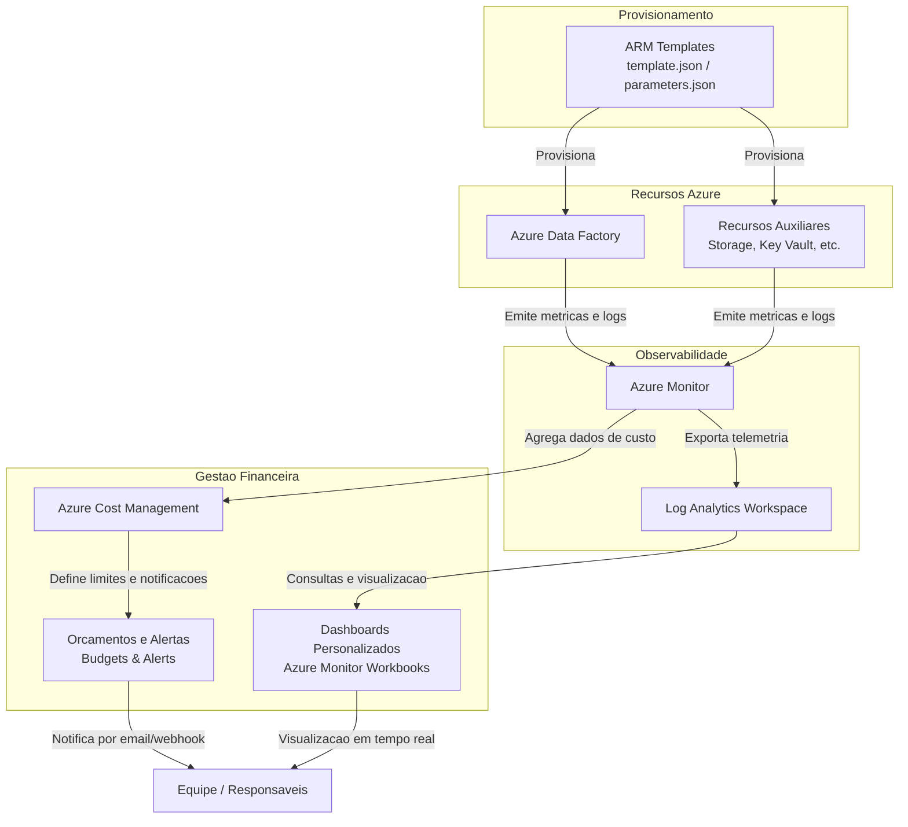
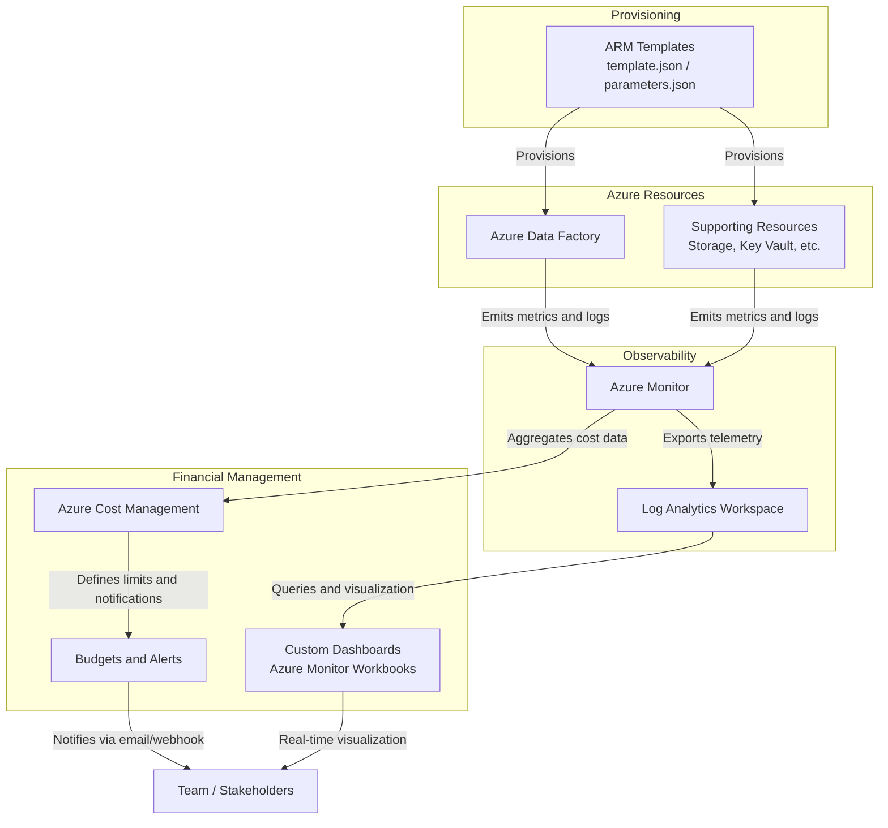

# Criando um Monitoramento de Custos no Data Factory


[](https://opensource.org/licenses/MIT)
[](https://azure.microsoft.com/services/data-factory/)
[](https://docs.microsoft.com/azure/cloud-shell/overview)
[](https://docs.microsoft.com/azure/azure-resource-manager/management/overview)

---

## Portugues

## Visao Geral

Este projeto, desenvolvido por Gabriel Demetrios Lafis como parte do programa **Microsoft AI for Tech - Azure Databricks** da **DIO**, demonstra a implementacao de um sistema robusto para monitoramento e gestao de custos no Azure Data Factory. O objetivo e fornecer uma solucao proativa para controlar os gastos, otimizar o uso de recursos e garantir a sustentabilidade financeira de projetos de integracao de dados na nuvem.

### Funcionalidades Implementadas

*   **Infraestrutura como Codigo (IaC) com ARM Templates:** Definicao e provisionamento da infraestrutura do Azure Data Factory e recursos associados de forma declarativa, garantindo consistencia e reprodutibilidade.
*   **Automacao com Azure Cloud Shell:** Utilizacao do Azure Cloud Shell para implantacao de templates ARM e execucao de scripts de gerenciamento, simplificando operacoes e eliminando a necessidade de instalacoes locais.
*   **Monitoramento e Acompanhamento Continuo:** Configuracao de dashboards personalizados, metricas e alertas de custo para uma visao em tempo real do consumo de recursos e identificacao rapida de desvios.
*   **Otimizacao de Custos:** Analise detalhada dos componentes de custo do Azure Data Factory e estrategias para otimizacao de pipelines, visando a reducao de gastos sem comprometer a performance.
*   **Estrutura de Projeto Profissional:** Organizacao do repositorio com pastas padronizadas (`src/`, `tests/`, `docs/`, `config/`, `assets/`) para facilitar a manutencao e colaboracao.

## Arquitetura da Solucao

O diagrama abaixo ilustra o fluxo completo da arquitetura de monitoramento de custos no Azure Data Factory, desde o provisionamento via ARM Templates ate a visualizacao em dashboards e disparo de alertas.



O fluxo comeca com os ARM Templates provisionando o Azure Data Factory e os recursos auxiliares. O Azure Monitor coleta metricas e logs de todos os recursos. O Azure Cost Management agrega os dados financeiros, permitindo a criacao de orcamentos e alertas automaticos. Um Log Analytics Workspace recebe a telemetria detalhada para consultas avancadas e alimenta dashboards interativos via Azure Monitor Workbooks. Todo o pipeline de observabilidade converge para notificacoes e visualizacoes centralizadas pela equipe responsavel.

## Tecnologias Utilizadas

| Categoria              | Tecnologia / Ferramenta                | Descricao                                                                                                    |
| :--------------------- | :------------------------------------- | :----------------------------------------------------------------------------------------------------------- |
| **Cloud**              | Azure Data Factory                     | Servico de integracao de dados baseado em nuvem para criar, agendar e orquestrar fluxos de trabalho de dados. |
|                        | ARM Templates                          | Infraestrutura como Codigo para provisionamento declarativo de recursos Azure.                               |
|                        | Azure Cloud Shell                      | Ambiente de shell interativo para gerenciar recursos Azure diretamente pelo navegador.                       |
|                        | Azure Monitor                          | Coleta, analisa e atua sobre dados de telemetria de ambientes Azure e locais.                                |
|                        | Azure Cost Management                  | Ferramenta para monitorar, alocar e otimizar custos na nuvem.                                                |
|                        | Log Analytics Workspace                | Repositorio centralizado de logs para consultas e analises avancadas.                                        |
| **Linguagens**         | JSON                                   | Utilizado para a definicao dos ARM Templates.                                                                |
|                        | Bash / PowerShell                      | Para scripts de automacao executados no Azure Cloud Shell.                                                   |
| **Controle de Versao** | Git / GitHub                           | Para controle de versao do codigo e colaboracao em equipe.                                                   |

## Instalacao e Configuracao

Para replicar este ambiente e sistema de monitoramento, siga os passos abaixo:

1.  **Pre-requisitos:**
    *   Uma conta Azure ativa.
    *   Acesso ao Azure Cloud Shell ou Azure CLI/PowerShell configurado localmente.
    *   Conhecimento basico de Azure Data Factory e conceitos de nuvem.

2.  **Clonar o Repositorio:**
    ```bash
    git clone https://github.com/galafis/Criando-um-Monitoramento-de-Custos-no-Data-Factory.git
    cd Criando-um-Monitoramento-de-Custos-no-Data-Factory
    ```

3.  **Provisionar Recursos com ARM Templates:**
    Navegue ate a pasta `config/` onde os templates ARM (`template.json` e `parameters.json`) estao localizados. Utilize o Azure Cloud Shell para implantar os recursos:
    ```bash
    # Exemplo de implantacao usando Azure CLI
    az deployment group create --resource-group <seu-grupo-de-recursos> \
                               --template-file config/template.json \
                               --parameters config/parameters.json
    ```
    *Substitua `<seu-grupo-de-recursos>` pelo nome do grupo de recursos onde voce deseja implantar o Data Factory.*

4.  **Configurar Monitoramento e Alertas:**
    Apos a implantacao, acesse o portal do Azure e configure:
    *   **Dashboards no Azure Monitor:** Crie workbooks personalizados em `Monitor > Workbooks` para visualizar metricas de execucao de pipelines, consumo de DIU (Data Integration Units) e latencia.
    *   **Orcamentos no Azure Cost Management:** Em `Cost Management > Budgets`, defina limites mensais por grupo de recursos ou por servico e configure alertas de email para notificacao automatica ao atingir percentuais do orcamento (ex.: 80%, 100%).
    *   **Alertas no Azure Monitor:** Em `Monitor > Alerts`, crie regras de alerta baseadas em metricas como `PipelineFailedRuns`, `ActivityFailedRuns` e custo acumulado, com acoes configuradas via Action Groups (email, webhook, SMS).

5.  **Verificar a Implantacao:**
    ```bash
    # Listar recursos implantados no grupo de recursos
    az resource list --resource-group <seu-grupo-de-recursos> --output table

    # Verificar pipelines disponiveis no Data Factory
    az datafactory pipeline list --resource-group <seu-grupo-de-recursos> \
                                 --factory-name <nome-do-data-factory>
    ```

## Estrutura do Repositorio

```
Criando-um-Monitoramento-de-Custos-no-Data-Factory/
├── src/                    # Codigo-fonte principal (scripts de pipeline, utilitarios)
├── tests/                  # Testes unitarios e de integracao
├── docs/                   # Documentacao adicional e guias de configuracao
├── config/
│   ├── template.json       # ARM Template principal
│   ├── parameters.json     # Parametros de implantacao
│   └── LICENSE             # Licenca MIT
└── assets/                 # Imagens, diagramas e recursos visuais
```

## Licenca

Este projeto esta licenciado sob a Licenca MIT. Consulte o arquivo [LICENSE](config/LICENSE) para mais detalhes.

## Autor

**Gabriel Demetrios Lafis**

*   [GitHub](https://github.com/galafis)
*   [LinkedIn](https://www.linkedin.com/in/gabriel-demetrios-lafis/)

---

## English

## Overview

This project, developed by Gabriel Demetrios Lafis as part of the **Microsoft AI for Tech - Azure Databricks** program by **DIO**, demonstrates the implementation of a robust system for monitoring and managing costs in Azure Data Factory. The goal is to provide a proactive solution to control expenses, optimize resource usage, and ensure the financial sustainability of cloud data integration projects.

### Implemented Features

*   **Infrastructure as Code (IaC) with ARM Templates:** Definition and provisioning of Azure Data Factory infrastructure and associated resources declaratively, ensuring consistency and reproducibility.
*   **Automation with Azure Cloud Shell:** Utilization of Azure Cloud Shell for deploying ARM templates and executing management scripts, simplifying operations and eliminating the need for local installations.
*   **Continuous Monitoring and Tracking:** Configuration of custom dashboards, metrics, and cost alerts for real-time visibility into resource consumption and quick identification of deviations.
*   **Cost Optimization:** Detailed analysis of Azure Data Factory cost components and strategies for pipeline optimization, aiming to reduce expenses without compromising performance.
*   **Professional Project Structure:** Organization of the repository with standardized folders (`src/`, `tests/`, `docs/`, `config/`, `assets/`) to facilitate maintenance and collaboration.

## Solution Architecture

The diagram below illustrates the complete architecture flow for cost monitoring in Azure Data Factory, from infrastructure provisioning via ARM Templates through to dashboard visualization and automated alerts.



The flow starts with ARM Templates provisioning Azure Data Factory and supporting resources. Azure Monitor collects metrics and logs from all resources. Azure Cost Management aggregates financial data, enabling the creation of budgets and automated alerts. A Log Analytics Workspace receives detailed telemetry for advanced queries and feeds interactive dashboards via Azure Monitor Workbooks. The entire observability pipeline converges into centralized notifications and visualizations for the responsible team.

## Technologies Used

| Category           | Technology / Tool                      | Description                                                                                             |
| :----------------- | :------------------------------------- | :------------------------------------------------------------------------------------------------------ |
| **Cloud**          | Azure Data Factory                     | Cloud-based data integration service for creating, scheduling, and orchestrating data workflows.        |
|                    | ARM Templates                          | Infrastructure as Code for declarative provisioning of Azure resources.                                 |
|                    | Azure Cloud Shell                      | Interactive shell environment for managing Azure resources via browser.                                 |
|                    | Azure Monitor                          | Collects, analyzes, and acts on telemetry data from Azure and on-premises environments.                 |
|                    | Azure Cost Management                  | Tool for monitoring, allocating, and optimizing cloud costs.                                            |
|                    | Log Analytics Workspace                | Centralized log repository for advanced queries and analytics.                                          |
| **Languages**      | JSON                                   | Used for defining ARM Templates.                                                                        |
|                    | Bash / PowerShell                      | For automation scripts executed in Azure Cloud Shell.                                                   |
| **Version Control** | Git / GitHub                          | For code version control and team collaboration.                                                        |

## Installation and Configuration

To replicate this environment and monitoring system, follow the steps below:

1.  **Prerequisites:**
    *   An active Azure account.
    *   Access to Azure Cloud Shell or Azure CLI/PowerShell configured locally.
    *   Basic knowledge of Azure Data Factory and cloud concepts.

2.  **Clone the Repository:**
    ```bash
    git clone https://github.com/galafis/Criando-um-Monitoramento-de-Custos-no-Data-Factory.git
    cd Criando-um-Monitoramento-de-Custos-no-Data-Factory
    ```

3.  **Provision Resources with ARM Templates:**
    Navigate to the `config/` folder where the ARM templates (`template.json` and `parameters.json`) are located. Use Azure Cloud Shell to deploy the resources:
    ```bash
    # Example deployment using Azure CLI
    az deployment group create --resource-group <your-resource-group> \
                               --template-file config/template.json \
                               --parameters config/parameters.json
    ```
    *Replace `<your-resource-group>` with the name of the resource group where you want to deploy the Data Factory.*

4.  **Configure Monitoring and Alerts:**
    After deployment, access the Azure portal and configure:
    *   **Dashboards in Azure Monitor:** Create custom workbooks under `Monitor > Workbooks` to visualize pipeline execution metrics, DIU (Data Integration Unit) consumption, and latency.
    *   **Budgets in Azure Cost Management:** Under `Cost Management > Budgets`, define monthly limits per resource group or per service and configure email alerts for automatic notification when budget thresholds are reached (e.g., 80%, 100%).
    *   **Alerts in Azure Monitor:** Under `Monitor > Alerts`, create alert rules based on metrics such as `PipelineFailedRuns`, `ActivityFailedRuns`, and accumulated cost, with actions configured via Action Groups (email, webhook, SMS).

5.  **Verify the Deployment:**
    ```bash
    # List resources deployed in the resource group
    az resource list --resource-group <your-resource-group> --output table

    # Check available pipelines in the Data Factory
    az datafactory pipeline list --resource-group <your-resource-group> \
                                 --factory-name <data-factory-name>
    ```

## Repository Structure

```
Criando-um-Monitoramento-de-Custos-no-Data-Factory/
├── src/                    # Main source code (pipeline scripts, utilities)
├── tests/                  # Unit and integration tests
├── docs/                   # Additional documentation and configuration guides
├── config/
│   ├── template.json       # Main ARM Template
│   ├── parameters.json     # Deployment parameters
│   └── LICENSE             # MIT License
└── assets/                 # Images, diagrams, and visual resources
```

## License

This project is licensed under the MIT License - see the [LICENSE](config/LICENSE) file for details.

## Author

**Gabriel Demetrios Lafis**

*   [GitHub](https://github.com/galafis)
*   [LinkedIn](https://www.linkedin.com/in/gabriel-demetrios-lafis/)
