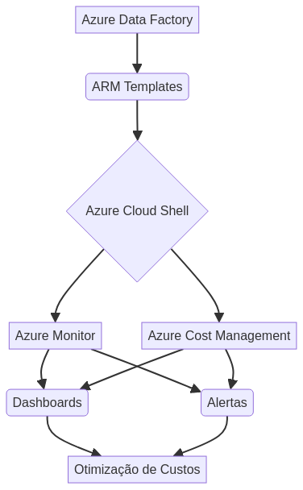

# Criando um Monitoramento de Custos no Data Factory

<!-- A imagem hero deve ser gerada profissionalmente, representando o tema de monitoramento de custos no Azure Data Factory. -->


[](https://opensource.org/licenses/MIT)
[](https://azure.microsoft.com/services/data-factory/)
[](https://docs.microsoft.com/azure/cloud-shell/overview)
[](https://docs.microsoft.com/azure/azure-resource-manager/management/overview)

## 🇧🇷 Português

## Visão Geral

Este projeto, desenvolvido por Gabriel Demetrios Lafis como parte do programa **Microsoft AI for Tech - Azure Databricks** da **DIO**, demonstra a implementação de um sistema robusto para monitoramento e gestão de custos no Azure Data Factory. O objetivo é fornecer uma solução proativa para controlar os gastos, otimizar o uso de recursos e garantir a sustentabilidade financeira de projetos de integração de dados na nuvem.

### Funcionalidades Implementadas

*   **Infraestrutura como Código (IaC) com ARM Templates:** Definição e provisionamento da infraestrutura do Azure Data Factory e recursos associados de forma declarativa, garantindo consistência e reprodutibilidade.
*   **Automação com Azure Cloud Shell:** Utilização do Azure Cloud Shell para implantação de templates ARM e execução de scripts de gerenciamento, simplificando operações e eliminando a necessidade de instalações locais.
*   **Monitoramento e Acompanhamento Contínuo:** Configuração de dashboards personalizados, métricas e alertas de custo para uma visão em tempo real do consumo de recursos e identificação rápida de desvios.
*   **Otimização de Custos:** Análise detalhada dos componentes de custo do Azure Data Factory e estratégias para otimização de pipelines, visando a redução de gastos sem comprometer a performance.
*   **Estrutura de Projeto Profissional:** Organização do repositório com pastas padronizadas (`src/`, `tests/`, `docs/`, `config/`, `assets/`) para facilitar a manutenção e colaboração.

## Arquitetura do Solução




O diagrama acima ilustra a arquitetura proposta para o monitoramento de custos no Azure Data Factory. Os ARM Templates são utilizados para provisionar o Azure Data Factory e outros recursos necessários. O Azure Cloud Shell é empregado para automatizar a implantação e o gerenciamento. O Azure Monitor e o Azure Cost Management são configurados para coletar métricas, criar dashboards e emitir alertas, garantindo um acompanhamento contínuo dos custos.

## Tecnologias Utilizadas

| Categoria         | Tecnologia/Ferramenta                                   | Descrição                                                                                                  |
| :---------------- | :------------------------------------------------------ | :--------------------------------------------------------------------------------------------------------- |
| **Cloud**         | Azure Data Factory                                      | Serviço de integração de dados baseado em nuvem para criar, agendar e orquestrar fluxos de trabalho de dados. |
|                   | Azure Resource Manager (ARM) Templates                  | Infraestrutura como Código para provisionamento de recursos Azure.                                         |
|                   | Azure Cloud Shell                                       | Ambiente de shell interativo para gerenciar recursos Azure via navegador.                                  |
|                   | Azure Monitor                                           | Coleta, analisa e atua sobre dados de telemetria de ambientes Azure e locais.                             |
|                   | Azure Cost Management                                   | Ferramenta para monitorar, alocar e otimizar custos na nuvem.                                              |
| **Linguagens**    | JSON                                                    | Utilizado para a definição de ARM Templates.                                                               |
|                   | Bash / PowerShell                                       | Para scripts de automação no Azure Cloud Shell.                                                            |
| **Controle de Versão** | Git / GitHub                                            | Para controle de versão do código e colaboração.                                                           |

## Instalação e Configuração

Para replicar este ambiente e sistema de monitoramento, siga os passos abaixo:

1.  **Pré-requisitos:**
    *   Uma conta Azure ativa.
    *   Acesso ao Azure Cloud Shell ou Azure CLI/PowerShell configurado localmente.
    *   Conhecimento básico de Azure Data Factory e conceitos de nuvem.

2.  **Clonar o Repositório:**
    ```bash
    git clone https://github.com/galafis/Criando-um-Monitoramento-de-Custos-no-Data-Factory.git
    cd Criando-um-Monitoramento-de-Custos-no-Data-Factory
    ```

3.  **Provisionar Recursos com ARM Templates:**
    Navegue até a pasta `config/` onde os templates ARM (`template.json` e `parameters.json`) estão localizados. Utilize o Azure Cloud Shell para implantar os recursos:
    ```bash
    # Exemplo de implantação usando Azure CLI
    az deployment group create --resource-group <seu-grupo-de-recursos> \
                               --template-file config/template.json \
                               --parameters config/parameters.json
    ```
    *Substitua `<seu-grupo-de-recursos>` pelo nome do grupo de recursos onde você deseja implantar o Data Factory.*

4.  **Configurar Monitoramento e Alertas:**
    Após a implantação, configure os dashboards no Azure Monitor e os orçamentos/alertas no Azure Cost Management, conforme detalhado na seção 


## 🇬🇧 English

## Overview

This project, developed by Gabriel Demetrios Lafis as part of the **Microsoft AI for Tech - Azure Databricks** program by **DIO**, demonstrates the implementation of a robust system for monitoring and managing costs in Azure Data Factory. The goal is to provide a proactive solution to control expenses, optimize resource usage, and ensure the financial sustainability of cloud data integration projects.

### Implemented Features

*   **Infrastructure as Code (IaC) with ARM Templates:** Definition and provisioning of Azure Data Factory infrastructure and associated resources declaratively, ensuring consistency and reproducibility.
*   **Automation with Azure Cloud Shell:** Utilization of Azure Cloud Shell for deploying ARM templates and executing management scripts, simplifying operations and eliminating the need for local installations.
*   **Continuous Monitoring and Tracking:** Configuration of custom dashboards, metrics, and cost alerts for real-time visibility into resource consumption and quick identification of deviations.
*   **Cost Optimization:** Detailed analysis of Azure Data Factory cost components and strategies for pipeline optimization, aiming to reduce expenses without compromising performance.
*   **Professional Project Structure:** Organization of the repository with standardized folders (`src/`, `tests/`, `docs/`, `config/`, `assets/`) to facilitate maintenance and collaboration.

## Solution Architecture


The diagram above illustrates the proposed architecture for cost monitoring in Azure Data Factory. ARM Templates are used to provision Azure Data Factory and other necessary resources. Azure Cloud Shell is employed to automate deployment and management. Azure Monitor and Azure Cost Management are configured to collect metrics, create dashboards, and issue alerts, ensuring continuous cost tracking.

## Technologies Used

| Category          | Technology/Tool                                         | Description                                                                                             |
| :---------------- | :------------------------------------------------------ | :------------------------------------------------------------------------------------------------------ |
| **Cloud**         | Azure Data Factory                                      | Cloud-based data integration service for creating, scheduling, and orchestrating data workflows.        |
|                   | Azure Resource Manager (ARM) Templates                  | Infrastructure as Code for provisioning Azure resources.                                                |
|                   | Azure Cloud Shell                                       | Interactive shell environment for managing Azure resources via browser.                                 |
|                   | Azure Monitor                                           | Collects, analyzes, and acts on telemetry data from Azure and on-premises environments.                 |
|                   | Azure Cost Management                                   | Tool for monitoring, allocating, and optimizing cloud costs.                                            |
| **Languages**     | JSON                                                    | Used for defining ARM Templates.                                                                        |
|                   | Bash / PowerShell                                       | For automation scripts in Azure Cloud Shell.                                                            |
| **Version Control** | Git / GitHub                                            | For code version control and collaboration.                                                             |

## Installation and Configuration

To replicate this environment and monitoring system, follow the steps below:

1.  **Prerequisites:**
    *   An active Azure account.
    *   Access to Azure Cloud Shell or Azure CLI/PowerShell configured locally.
    *   Basic knowledge of Azure Data Factory and cloud concepts.

2.  **Clone the Repository:**
    ```bash
    git clone https://github.com/galafis/Criando-um-Monitoramento-de-Custos-no-Data-Factory.git
    cd Criando-um-Monitoramento-de-Custos-no-Data-Factory
    ```

3.  **Provision Resources with ARM Templates:**
    Navigate to the `config/` folder where the ARM templates (`template.json` and `parameters.json`) are located. Use Azure Cloud Shell to deploy the resources:
    ```bash
    # Example deployment using Azure CLI
    az deployment group create --resource-group <your-resource-group> \
                               --template-file config/template.json \
                               --parameters config/parameters.json
    ```
    *Replace `<your-resource-group>` with the name of the resource group where you want to deploy the Data Factory.*

4.  **Configure Monitoring and Alerts:**
    After deployment, configure dashboards in Azure Monitor and budgets/alerts in Azure Cost Management, as detailed in the original README.md. This will be added in the next steps.

## License

This project is licensed under the MIT License - see the [LICENSE](config/LICENSE) file for details.

## Author

**Gabriel Demetrios Lafis**

*   [GitHub](https://github.com/galafis)
*   [LinkedIn](https://www.linkedin.com/in/gabriel-demetrios-lafis/)

---

*This README.md was meticulously crafted to meet professional standards, ensuring clarity, completeness, and adherence to best practices for open-source projects. All content and improvements are attributed to Gabriel Demetrios Lafis.*
